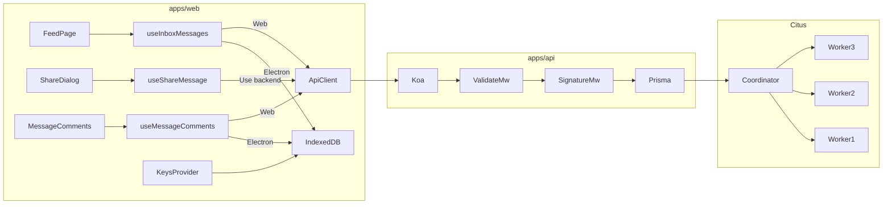

# Monorepo + Koa Backend + Citus Local Stack

## Target layout

```text
encrypt/
├── apps/
│   ├── web/                 # current React/Vite/Electron app (moved from root src/)
│   └── api/                 # new Koa + Prisma backend
├── packages/
│   └── schemas/             # JSON Schema + shared crypto verify helpers
├── docker-compose.yml
├── docker-compose.citus.yml # Citus coordinator + 3 workers (or single compose file)
└── package.json             # npm workspaces root
```

Use **npm workspaces** (already on npm + Node 24) — no Turborepo/Nx unless you want it later.



---

## 1. Monorepo migration

**Move existing app** into [`apps/web/`](apps/web/):

- `src/`, `electron/`, `public/`, `vite/`, `index.html`, `vite.config.ts`, `tsconfig*.json`, `.env.electron`
- Update paths in `vite.config.ts`, `electron-builder` `files`, CI workflows (`.github/workflows/*`), and root scripts

**Root [`package.json`](package.json)** becomes workspace orchestrator:

```json
{
  "workspaces": ["apps/*", "packages/*"],
  "scripts": {
    "dev": "npm run dev -w @encrypt/web",
    "dev:api": "npm run dev -w @encrypt/api",
    "dev:stack": "docker compose up -d && npm run dev:api",
    "db:migrate": "npm run migrate -w @encrypt/api"
  }
}
```

**New [`packages/schemas`](packages/schemas/)** — single source of truth for wire formats currently defined in:

- [`src/types/manifest.ts`](src/types/manifest.ts) (`version: 9`, `wrap: ephemeral-sender-ecdhe-hkdf-aes`)
- [`src/types/manifestShare.ts`](src/types/manifestShare.ts) (`version: 1`, `wrap: manifest-share-v1`)
- [`src/types/comment.ts`](src/types/comment.ts) (`version: 1`, `wrap: message-bound-aes`)

Export:

- JSON Schema files (AJV-ready: `additionalProperties: false`, `const` for `version`/`wrap`, `maxLength` on base64/JWK strings, `required` lists)
- `serializeForSigning`, `verifyManifestSignature`, `verifyManifestShareSignature`, `verifyCommentSignature` ported from [`src/crypto/manifestSign.ts`](src/crypto/manifestSign.ts), [`src/crypto/manifestShare.ts`](src/crypto/manifestShare.ts), [`src/crypto/commentCrypto.ts`](src/crypto/commentCrypto.ts) using Node 24 `crypto.subtle` (same canonical JSON field order as the app)

`apps/web` imports schemas package for tests; `apps/api` uses AJV + verify helpers.

---

## 2. Docker Compose (local only)

Single [`docker-compose.yml`](docker-compose.yml) at repo root:

| Service             | Image                                           | Role                                         |
| ------------------- | ----------------------------------------------- | -------------------------------------------- |
| `citus-coordinator` | `citusdata/citus:12.1`                          | Coordinator + Postgres, DB `encrypt_feed`    |
| `citus-worker-1..3` | same                                            | 3 worker nodes                               |
| `api`               | build `apps/api/Dockerfile`                     | Koa on `:3000`, `DATABASE_URL` → coordinator |
| `web`               | build `apps/web/Dockerfile` (dev: Vite `:5173`) | `VITE_API_URL=http://api:3000`               |

**Citus bootstrap** (init script mounted into coordinator):

1. `CREATE EXTENSION citus;`
2. Register workers (`citus_add_node` for worker-1..3)
3. After Prisma migrations, run distribution SQL (see §4)

**Networking**: `web` → `api` → `citus-coordinator`; workers on internal network only.

Env files:

- `apps/api/.env.example` — `DATABASE_URL`, `PORT=3000`
- `apps/web/.env.development` — `VITE_API_URL=http://localhost:3000`

---

## 3. Koa API (`apps/api`)

**Stack**: Koa, `@koa/router`, `koa-bodyparser`, `ajv` + `ajv-formats`, `@prisma/client`, `zod` only if needed for query params.

**Middleware pipeline** (per route group):

```text
request → bodyParser (5MB limit, mirrors MAX_IMPORT_JSON_FILE_BYTES)
       → validateBody(schemaName)   // AJV strict; reject unknown keys
       → verifySignature(type)      // sender | sharer | comment-sender
       → handler → Prisma transaction
       → JSON response
```

**Routes (v1)**

| Method | Path            | Body schema                              | Signature                    | Notes                                                      |
| ------ | --------------- | ---------------------------------------- | ---------------------------- | ---------------------------------------------------------- |
| `POST` | `/api/shares`   | `{ share, keyManifest, parentMessage? }` | `sharerSignature` on `share` | Upsert parent core if `parentMessage` provided and missing |
| `GET`  | `/api/inbox`    | —                                        | —                            | `?recipientKeyId=` required                                |
| `POST` | `/api/comments` | `CommentPayload`                         | `senderSignature`            | Parent `messageId` must exist in DB                        |
| `GET`  | `/api/comments` | —                                        | —                            | `?messageId=&recipientKeyId=`                              |

**Inbox GET logic** — mirror [`listStoredMessagesForRecipientKeyId`](src/services/db/storedMessages.ts):

1. Query `message_key_manifest` where `recipient_key_id = ?` (Citus routes to correct shard)
2. Load matching `messages` / `shares` rows
3. Resolve parent messages for share deliveries
4. Apply same visibility filter as [`filterFeedInboxMessages`](src/utils/feedInboxVisibility.ts) server-side
5. Return array of `{ id, type: 'message'|'share', parentMessageId?, payload, createdAt, keyManifest }` so web client can decrypt like today

**Share POST logic** — mirror [`saveStoredShare`](src/services/db/storedShares.ts):

1. Validate share wire + keyManifest (each recipient entry `keyId` must match map key)
2. Verify `verifyManifestShareSignature`
3. If parent row missing: require `parentMessage` core in request; verify sender signature; insert parent
4. Insert share core + manifest shards in one transaction
5. Shard writes use `recipient_key_id` from each keyManifest entry (distribution column)

**Comments** — mirror [`storedComments.ts`](src/services/db/storedComments.ts):

- POST: validate + verify + insert
- GET: list by `messageId`, filter visibility server-side using same rules as [`commentVisibleToRecipient`](src/services/db/storedComments.ts) (recipient must have manifest shard for thread root)

**Error shape**: `{ error: string }` with 400 (validation/signature), 404 (parent missing), 409 (duplicate share id).

---

## 4. Database: Prisma + Citus sharding

**Prisma schema** (`apps/api/prisma/schema.prisma`) — one database `encrypt_feed`:

```prisma
model Message {
  id        String   @id @db.Uuid
  payload   String   // manifest core JSON
  createdAt DateTime @default(now())
}

model Share {
  id              String   @id @db.Uuid
  parentMessageId String   @db.Uuid
  payload         String   // share core JSON
  createdAt       DateTime @default(now())
  @@index([parentMessageId])
}

model Comment {
  id        String   @id @db.Uuid
  messageId String   @db.Uuid  // thread root id
  payload   String
  createdAt DateTime @default(now())
  @@index([messageId])
}

model MessageKeyManifestShard {
  messageId       String @db.Uuid
  recipientKeyId  String // Citus distribution column — RFC 7638 thumbprint
  entryJson       String // KeyManifestRecipientPayload JSON
  @@id([messageId, recipientKeyId])
  @@index([recipientKeyId])
}
```

**Citus distribution** (post-migration SQL in `apps/api/prisma/citus/`):

| Table                         | Citus role                 | Distribution key |
| ----------------------------- | -------------------------- | ---------------- |
| `MessageKeyManifestShard`     | **distributed**            | `recipientKeyId` |
| `Message`, `Share`, `Comment` | **reference** (replicated) | —                |

Rationale: inbox queries are `WHERE recipient_key_id = ?` (same as IndexedDB [`messageKeyManifest` index on `keyId`](src/services/db/cryptoDb.ts)). `keyId` is a SHA-256 thumbprint → even spread across 3 workers; adding workers later only requires `citus_add_node` + rebalance.

**Prisma + Citus caveat**: Prisma Migrate creates tables on coordinator; run Citus `create_reference_table` / `create_distributed_table` as a follow-up step in `npm run db:citus:distribute` (document in `apps/api/README.md`). Prisma does not manage Citus metadata — keep distribution SQL versioned alongside migrations.

---

## 5. Frontend changes (`apps/web`)

**Environment gating** (same pattern as `VITE_ELECTRON`):

```ts
const useBackend =
  !import.meta.env.VITE_ELECTRON && Boolean(import.meta.env.VITE_API_URL);
```

**New [`src/services/api/feedApi.ts`](apps/web/src/services/api/feedApi.ts)** — thin fetch wrapper for inbox, comments, share POST.

### Feed inbox ([`useInboxMessages.ts`](src/hooks/useInboxMessages.ts))

- `useBackend === true` → `GET /api/inbox?recipientKeyId=`
- `useBackend === false` (Electron) → existing IndexedDB path unchanged
- Map API response into existing `StoredFeedDelivery` shape for `MessageInbox` / decrypt flows

### Comments ([`useMessageComments.ts`](src/hooks/useMessageComments.ts))

- Web: `GET /api/comments?messageId=&recipientKeyId=`
- Electron: IndexedDB unchanged
- **User labels** still from local IndexedDB [`storedPublicKeys.ts`](src/services/db/storedPublicKeys.ts) (`listStoredUsers`) — per your requirement

### Share dialog ([`ShareMessageDialog.tsx`](src/components/inbox/ShareMessageDialog.tsx) + [`useShareMessage.ts`](src/hooks/useShareMessage.ts))

Add third action **"Use backend"** (outlined/contained, hidden when `VITE_ELECTRON`):

1. Reuse `buildShareDelivery` (same crypto as export)
2. `assembleShareExportPayloadJson` for wire body
3. Include `parentMessage` core JSON if parent is only local (so backend can store thread root)
4. `POST /api/shares`
5. On success: optionally `prependMessage` locally for immediate UI (web cache) or reload inbox

**EncryptMessage / send** — stays local-only for v1 (per your choice). Web feed shows backend share deliveries addressed to the viewer.

### Compose page ([`useEncryptComment.ts`](src/hooks/useEncryptComment.ts))

- Web: after local encrypt, also `POST /api/comments`
- Electron: local only

---

## 6. Implementation order

1. **Scaffold monorepo** — move web app, root workspaces, fix CI paths
2. **`packages/schemas`** — JSON Schema + signature verify (unit tests against existing vitest vectors from crypto tests)
3. **`apps/api` skeleton** — Koa, middleware, health check
4. **Prisma schema + migrate** — local Postgres first, then Citus compose
5. **Citus init + distribute script** — 3 workers, reference + distributed tables
6. **API routes** — shares POST, inbox GET, comments POST/GET
7. **Docker compose** — wire api + citus + web
8. **FE integration** — `feedApi.ts`, hook splits, Share dialog button, comment POST on web

---

## 7. Out of scope (v1)

- Auth / API keys (payload integrity relies on ECDSA signatures only)
- Syncing local IndexedDB ↔ backend
- One-to-one messages / tray encrypt (remain Electron-local)
- User directory on backend (usernames stay IndexedDB)
- Production deployment / TLS

---

## Key files to leverage (no reimplementation from scratch)

| Concern                     | Existing file                                                            |
| --------------------------- | ------------------------------------------------------------------------ |
| Manifest validation rules   | [`src/crypto/manifestDecrypt.ts`](src/crypto/manifestDecrypt.ts)         |
| Share validation + verify   | [`src/crypto/manifestShare.ts`](src/crypto/manifestShare.ts)             |
| Comment validation + verify | [`src/crypto/commentCrypto.ts`](src/crypto/commentCrypto.ts)             |
| Share export wire shape     | [`src/crypto/exportFeedMessage.ts`](src/crypto/exportFeedMessage.ts)     |
| Inbox query semantics       | [`src/services/db/storedMessages.ts`](src/services/db/storedMessages.ts) |
| JSON size / nesting limits  | [`src/utils/validateBaseJsonText.ts`](src/utils/validateBaseJsonText.ts) |
